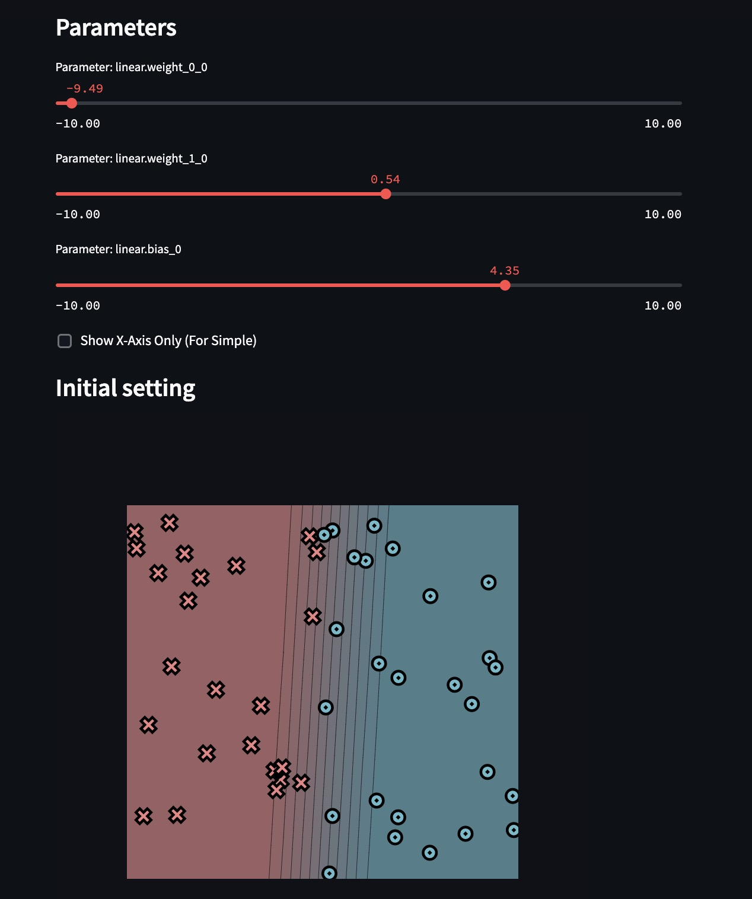

# MiniTorch Module 0

Foundations: the elementary math operators and the `Module` container that the
rest of MiniTorch is built on.


- Docs: https://minitorch.github.io/
- Overview: https://minitorch.github.io/module0.html

## What's implemented

- **`minitorch/operators.py`**
  - Scalar math: `mul`, `add`, `neg`, `lt`, `eq`, `max`, `is_close`, `sigmoid`
    (the stable two-branch form), `relu`, `log`, `exp`, `inv`.
  - Backward helpers `log_back`, `inv_back`, `relu_back`, each returning
    `d * f'(x)` for the chain rule. `log` and `inv` add a small `EPS` so they
    stay finite at 0.
  - Higher-order functions `map`, `zipWith`, `reduce`, plus the wrappers built
    on them: `negList`, `addLists`, `sum`, `prod`.
- **`minitorch/module.py`**
  - `Module`: a tree of child modules and parameters, with `train`/`eval` mode
    propagation and recursive `named_parameters` (dotted names for nested
    modules). Missing attributes raise `AttributeError`, matching PyTorch.
  - `Parameter`: a small container that flags its value as requiring a gradient.

## Tests

```
python run_tests.py
```

## Task 0.5


