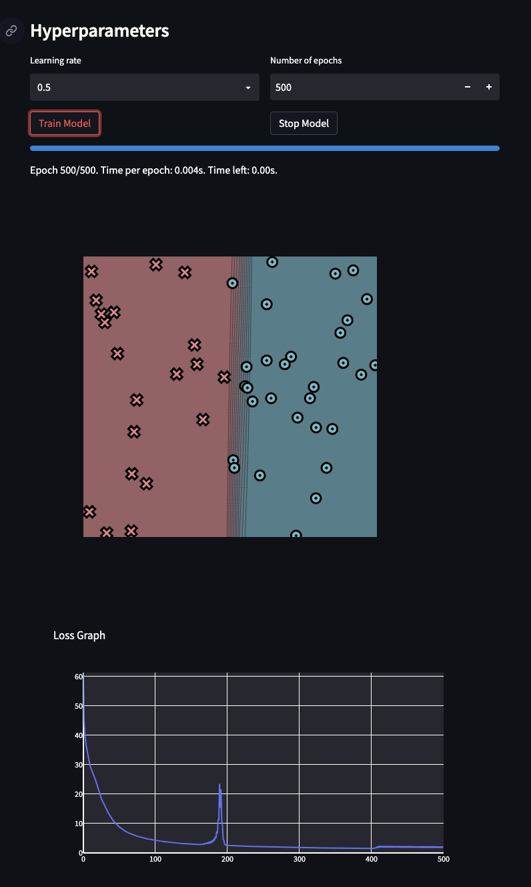
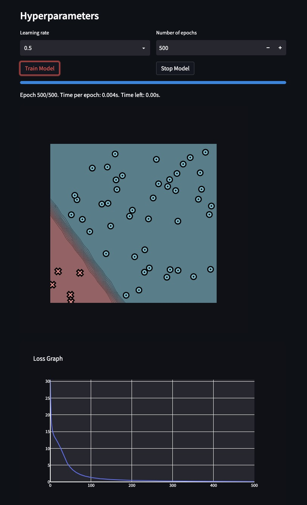
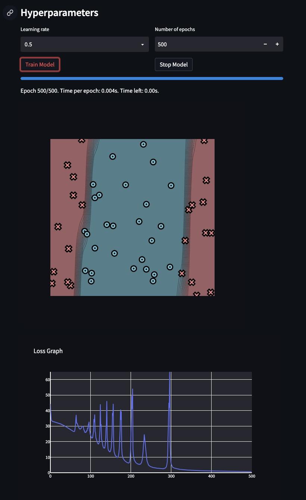
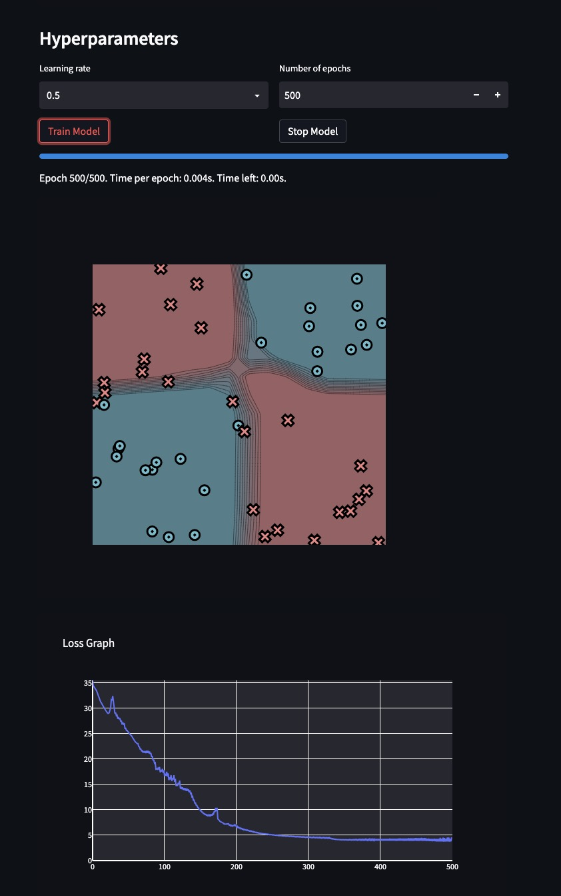

# MiniTorch Module 1

Scalar autodifferentiation: a `Scalar` type that records the operations that
produced it, then replays them backward to compute gradients.


- Docs: https://minitorch.github.io/
- Overview: https://minitorch.github.io/module1/module1/

## What's implemented

- **`minitorch/scalar_functions.py`** — forward and backward for each operation
  (`Add`, `Mul`, `Inv`, `Neg`, `Log`, `Exp`, `Sigmoid`, `ReLU`, `LT`, `EQ`).
  Forward computes the value and saves whatever backward needs; backward returns
  the local derivative times the incoming gradient.
- **`minitorch/scalar.py`** — the `Scalar` wrapper, its operator overloads,
  `chain_rule`, and gradient accumulation on leaf variables.
- **`minitorch/autodiff.py`** — `central_difference` (numerical gradient check),
  `topological_sort` of the computation graph, and `backpropagate`, which walks
  the graph in reverse order and accumulates each node's derivative.

Gradients are checked against `central_difference`, and `project/run_scalar.py`
trains a small scalar network on the toy datasets.

## Building on Module 0

```bash
python sync_previous_module.py previous-module-dir current-module-dir
```

Synced files: `operators.py`, `module.py`, and their tests.

## Results

Training on the four datasets:





