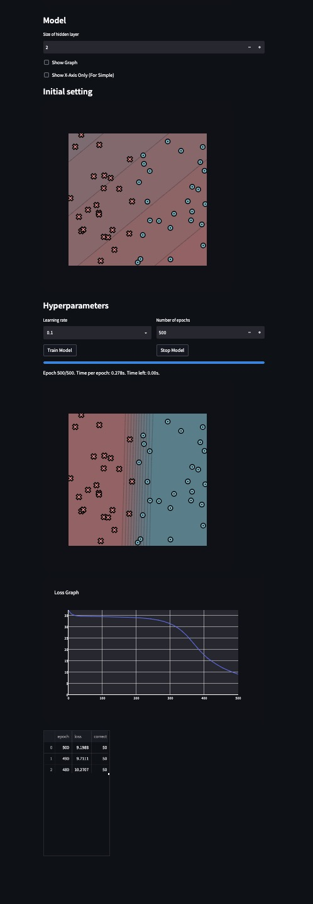
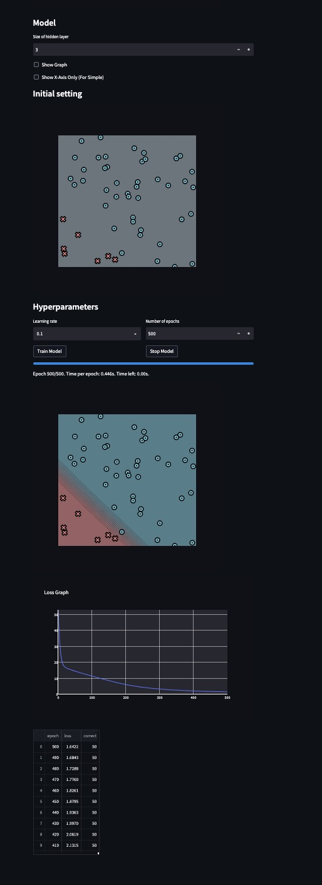
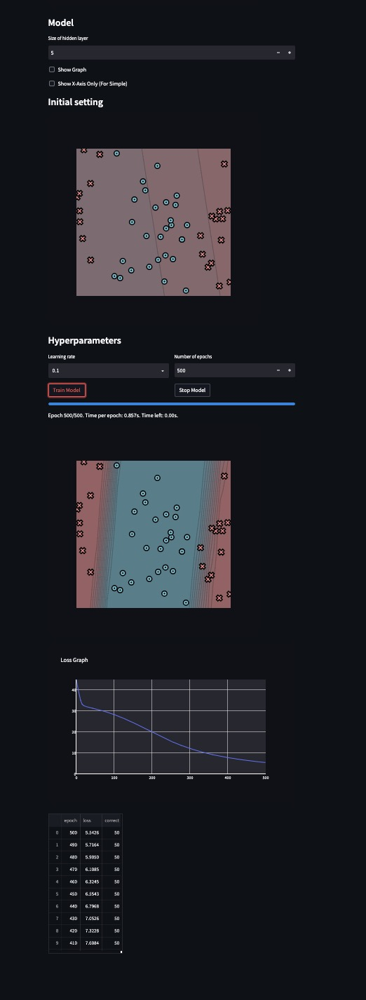
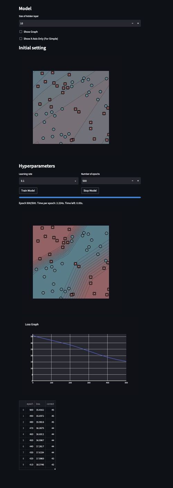

# MiniTorch Module 2

Tensors: the autodiff ideas from Module 1, now over multidimensional arrays with
strides and broadcasting.


- Docs: https://minitorch.github.io/
- Overview: https://minitorch.github.io/module2/module2/

## What's implemented

- **`minitorch/tensor_data.py`** — the storage / shape / strides layout:
  `index_to_position`, `to_index`, `broadcast_index`, `shape_broadcast`, and
  `permute` (a view that reorders strides without copying data).
- **`minitorch/tensor_ops.py`** — broadcast-aware `tensor_map`, `tensor_zip`,
  and `tensor_reduce` that back every elementwise and reduction op.
- **`minitorch/tensor_functions.py`** — forward/backward for the tensor ops
  (`Mul`, `Sigmoid`, `ReLU`, `Log`, `Exp`, `Sum`, `LT`, `EQ`, `IsClose`,
  `Permute`, alongside the existing `Add`/`Neg`/`View`/`MatMul`). Every backward
  pass passes the numerical gradient check.

Broadcasting in the backward pass is undone by reducing each gradient back to
its input's shape.

## Building on Module 1

```bash
python sync_previous_module.py previous-module-dir current-module-dir
```

## Results





