# MiniTorch Module 3

Speed: the tensor ops from Module 2, re-implemented as parallel CPU kernels
(Numba JIT) and GPU kernels (CUDA).


- Docs: https://minitorch.github.io/
- Overview: https://minitorch.github.io/module3.html

## What's implemented

- **`minitorch/fast_ops.py`** — `tensor_map`, `tensor_zip`, `tensor_reduce`, and
  the batched matrix multiply as `@njit(parallel=True)` kernels. The outer loops
  run over `prange`; `map`/`zip` take a stride-aligned fast path when the shapes
  already line up, skipping the per-element index math.
- **`minitorch/cuda_ops.py`** — CUDA versions of map and zip (one thread per
  output element), a shared-memory tree reduction (`_sum_practice` and
  `tensor_reduce`), and tiled matrix multiply (`_mm_practice` plus the full
  batched `_tensor_matrix_multiply`), which stages 32×32 blocks of each operand
  in shared memory.

## Tests

```
python run_tests.py
```

Several tests only run on a GPU machine and are skipped on GitHub's CI; use a
Colab GPU runtime to run them.

## Building on Module 2

```bash
python sync_previous_module.py previous-module-dir current-module-dir
```

`tensor_functions.py` needs a small change here so the tensor ops route through
`FastOps`.

## Results

Parallel-check output and CPU/GPU timing comparisons:

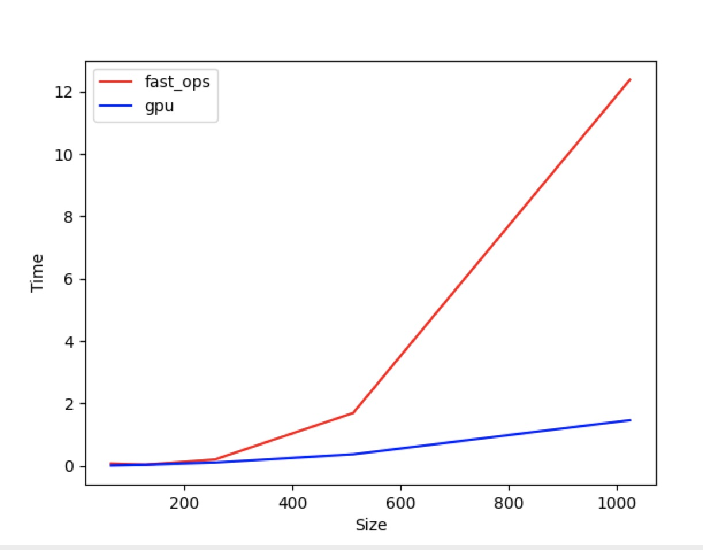
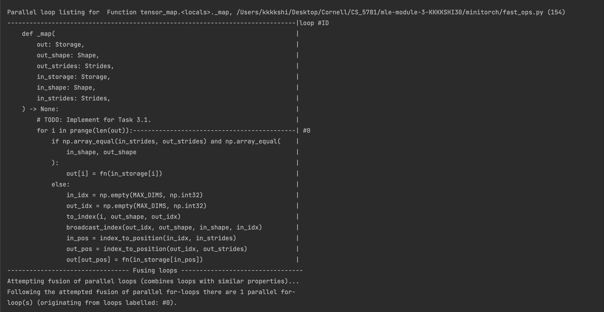
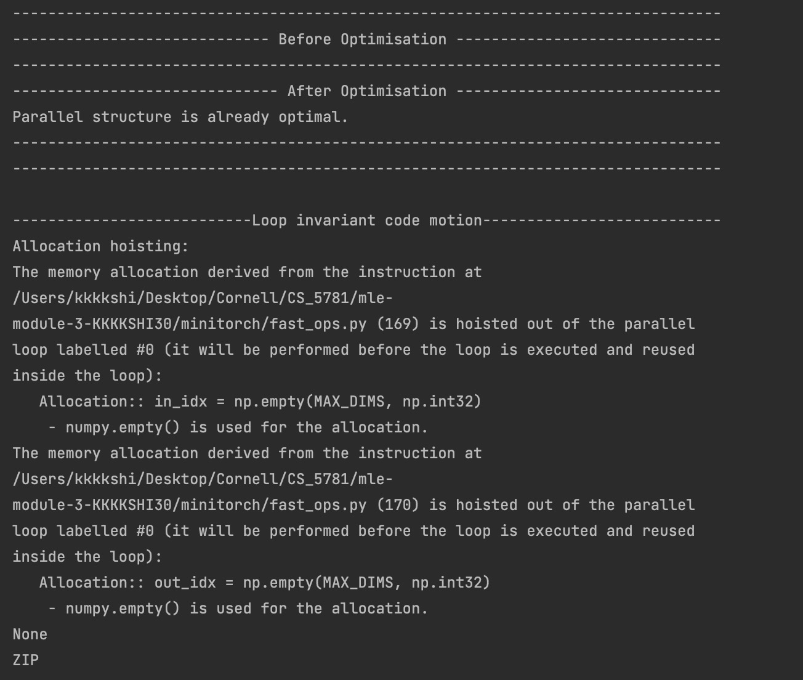
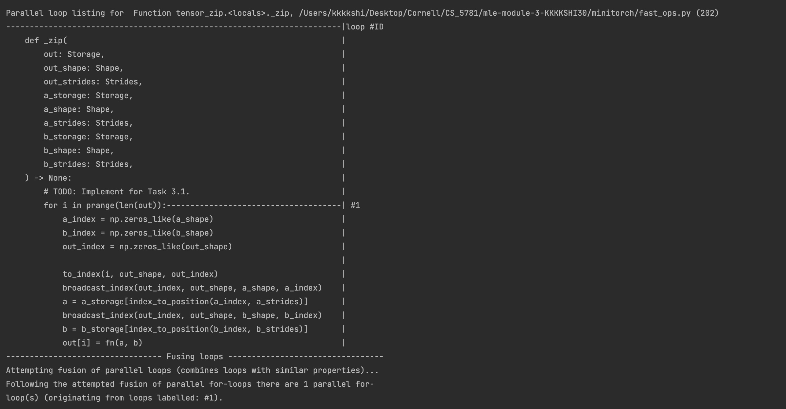
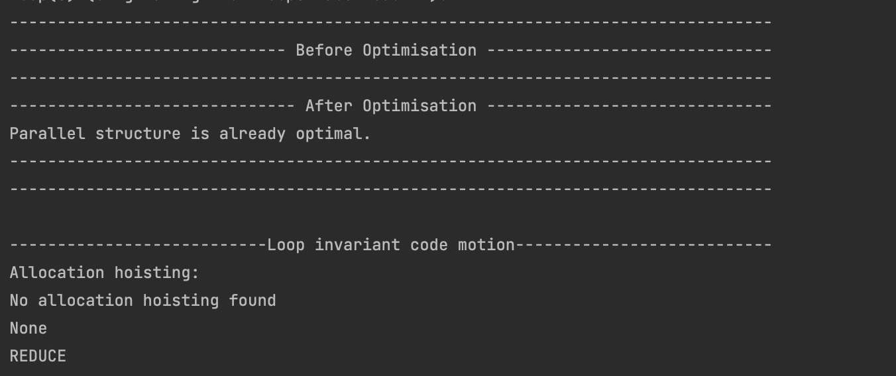
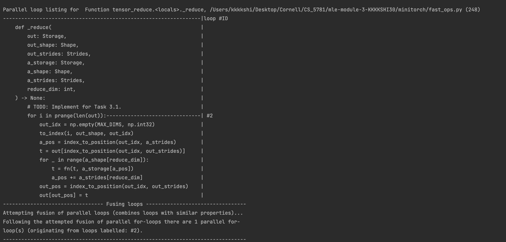
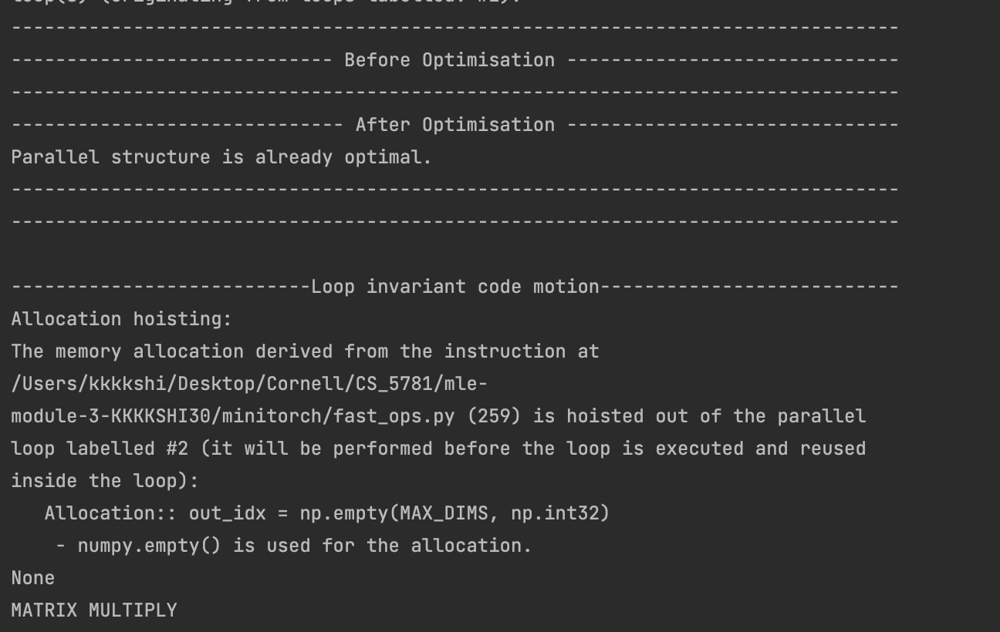
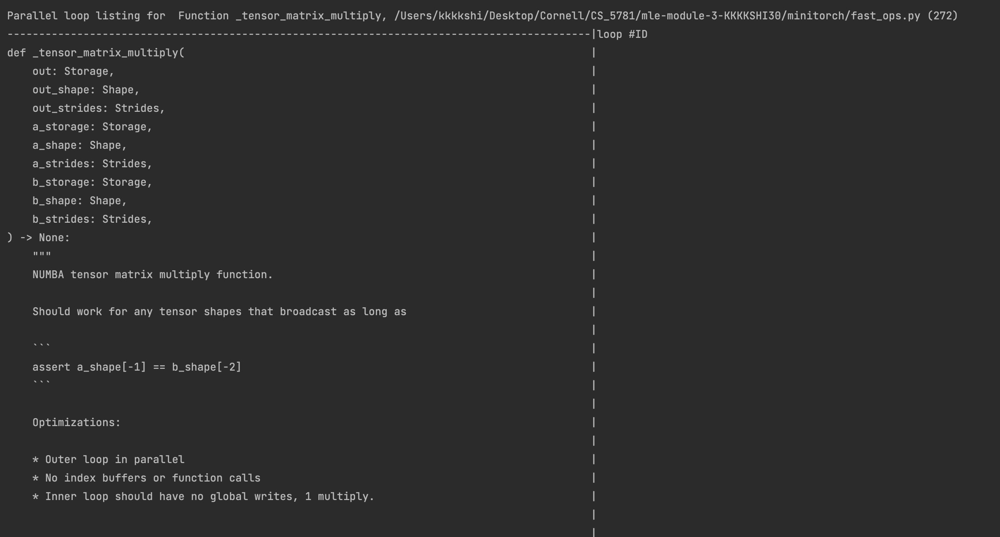
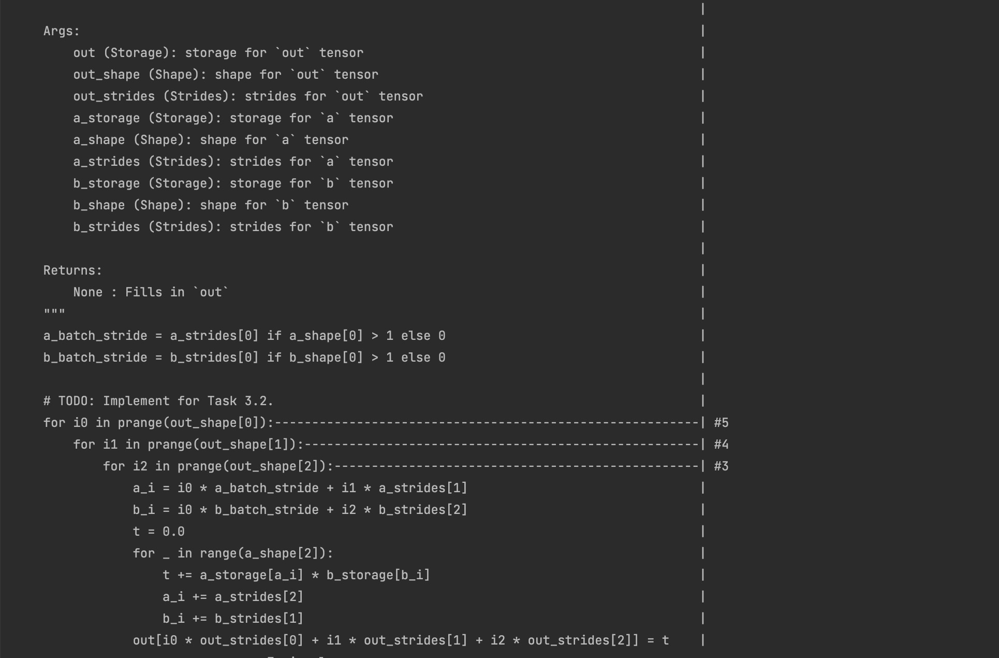
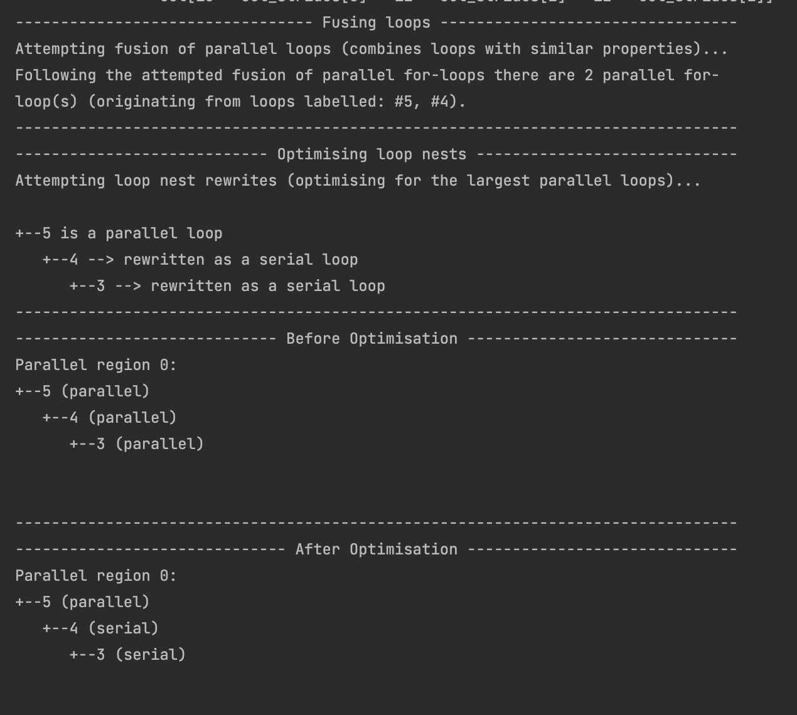
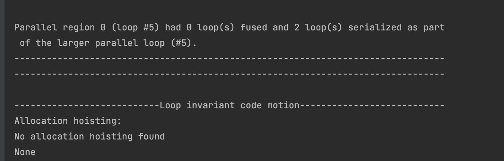

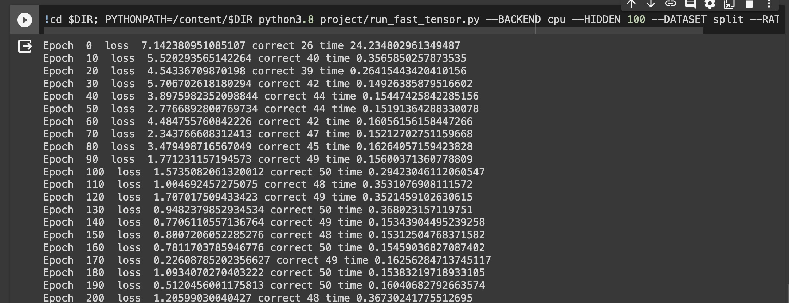
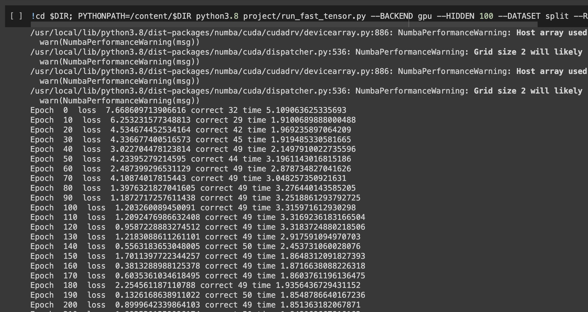
